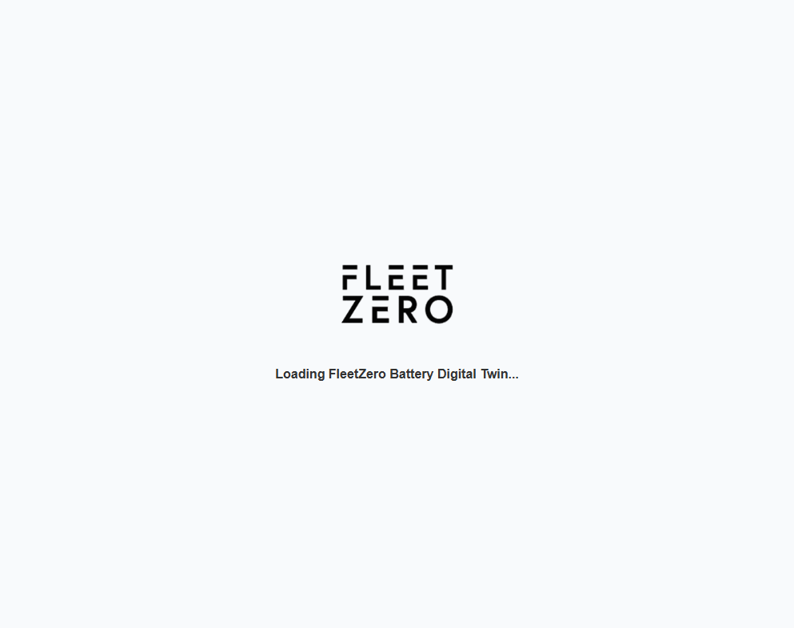
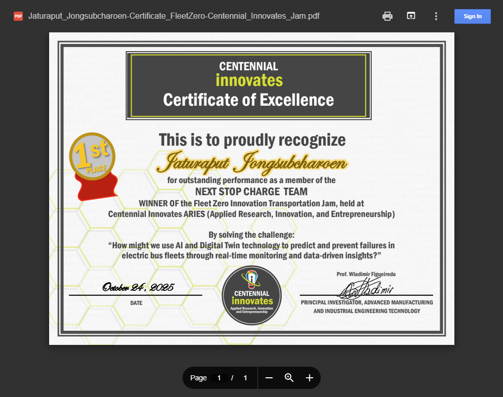

# AI Battery Intelligence with Digital Twin - Backend

## Hackathon Highlight (1st Place)

[](https://frontend-hackathon-next-stop-station.onrender.com/)

[](https://client-jaturaput-portfolio.onrender.com/certificate/Jaturaput_Jongsubcharoen-Certificate_FleetZero-Centennial_Innovates_Jam.pdf)

This backend powers the **AI Battery Intelligence with Digital Twin** platform built during the **Fleet Zero Innovation Transportation Jam** by team **NextStop Charge**.

- Result: **1st Place Winner**
- Event: **Centennial Innovates ARIES (Applied Research, Innovation, and Entrepreneurship)**
- Certificate date: **October 24, 2025**
- Live demo (Operator Dashboard): [https://frontend-hackathon-next-stop-station.onrender.com/](https://frontend-hackathon-next-stop-station.onrender.com/)
- Live demo (Driver Monitor, /driver version): [https://frontend-hackathon-next-stop-station.onrender.com/driver-monitor](https://frontend-hackathon-next-stop-station.onrender.com/driver-monitor)
- Backend API (health): [https://backend-hackathon-next-stop-station-node.onrender.com/api](https://backend-hackathon-next-stop-station-node.onrender.com/api)
- Backend API (battery data): [https://backend-hackathon-next-stop-station-node.onrender.com/api/battery](https://backend-hackathon-next-stop-station-node.onrender.com/api/battery)
- Backend API (trend data): [https://backend-hackathon-next-stop-station-node.onrender.com/api/battery/trend](https://backend-hackathon-next-stop-station-node.onrender.com/api/battery/trend)
- Backend API (per-bus trend example): [https://backend-hackathon-next-stop-station-node.onrender.com/api/battery/trend/101](https://backend-hackathon-next-stop-station-node.onrender.com/api/battery/trend/101)
- Frontend repo: [Frontend-Hackathon-Next-Stop-Station](https://github.com/Jaturaput-Jongsubcharoen/Frontend-Hackathon-Next-Stop-Station)
- Backend repo: [Backend-Hackathon-Next-Stop-Station-Node](https://github.com/Jaturaput-Jongsubcharoen/Backend-Hackathon-Next-Stop-Station-Node)

## Project Purpose

This Node.js API simulates a fleet battery telemetry backend for an electric-bus digital twin use case. It provides:

- Fleet-wide battery and health metrics for operator monitoring.
- Per-bus AI trend forecast data used in predictive maintenance charts.
- Status and risk signals used by both the **Fleet Operator Dashboard** and the **Driver Monitor Dashboard**.

## Tech Stack

- Node.js + Express 5
- CORS + dotenv
- In-memory mock dataset (no database required for demo)

## Backend Responsibilities in the Demo

- Serve fleet dataset for 12 buses with mixed health states.
- Expose trend endpoints for dashboard visualizations.
- Simulate AI-style predictive decline with confidence bounds.
- Allow frontend access from local and deployed environments via CORS.

## API Endpoints

Base URL (local): `http://localhost:8084`

### `GET /api/battery`

Returns full fleet snapshot:

- `timestamp`
- `buses[]` including:
	- identity and status: `id`, `status`, `condition`
	- battery metrics: `soc`, `soh`, `voltage`, `current`, `temperature`, `cycles`
	- operational metrics: `maxCellTemp`, `internalResistance`, `remainingRange`
	- AI layer: `healthScore`, `predictiveAlert`, `optimization`, `estimatedFailureRisk`
	- sustainability: `co2Saved`, `batteryLifeExtended`

### `GET /api/battery/trend`

Returns fleet-average historical-like trend for overview charting.

### `GET /api/battery/trend/:busId`

Returns per-bus 7-day forecast:

- `day`
- `performance`
- `lower`
- `upper`

Used directly by the operator dashboard for "AI-Predicted Battery Performance (Next 7 Days)".

### `GET /api`

Simple health/test endpoint used during development.

## Driver View Support (Important)

The backend is also critical for the **Driver Monitor** experience (`/driver-monitor` in frontend):

- Provides current SoC/SoH/cycle metrics for a driver-facing quick-read card.
- Provides risk condition labels (`HEALTHY`, `WARNING`, `CRITICAL`, `MAINTENANCE`) that are converted into visual state cues in the driver UI.
- Enables fast fallback to an active bus when fleet data includes offline buses.

## Local Installation and Run

### 1. Clone

```bash
git clone https://github.com/Jaturaput-Jongsubcharoen/Backend-Hackathon-Next-Stop-Station-Node.git
cd Backend-Hackathon-Next-Stop-Station-Node
```

### 2. Install dependencies

```bash
npm install
```

### 3. Configure environment

Create/update `.env`:

```env
PORT=8084
URL_FRONTEND=http://localhost:5173
```

For deployed frontend, set `URL_FRONTEND` to your production frontend URL.

### 4. Start server

```bash
npm run start
```

Development mode:

```bash
npm run dev
```

Server default local URL:

`http://localhost:8084`

## Frontend Integration Steps

1. Run backend first.
2. In frontend repo `.env`, set:

```env
VITE_BE_URL=http://localhost:8084
```

3. Start frontend and open:
	 - Operator: `http://localhost:5173/`
	 - Driver: `http://localhost:5173/driver-monitor`

## My Role and Skills Demonstrated

As a full-stack contributor in the hackathon, this backend demonstrates:

- REST API design for telemetry-driven dashboards.
- Data modeling for digital twin entities and fleet scenarios.
- Predictive analytics simulation logic (trend and risk behavior).
- Cross-origin deployment configuration for cloud-hosted frontend/backend.
- Integration support for multi-persona UX (operator vs driver).

## License

MIT (see `LICENSE`)

